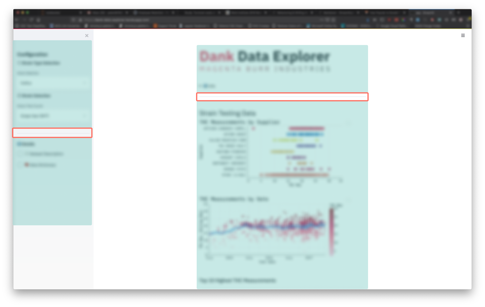

# Markdown

- [Markdown](#markdown)
  - [Summary](#summary)
  - [Using Markdown Files](#using-markdown-files)
  - [Conditionally Displaying Long Content](#conditionally-displaying-long-content)
    - [Hide it with a `st.checkbox`](#hide-it-with-a-stcheckbox)
    - [Use `<details><summary>` Elements in Markdown](#use-detailssummary-elements-in-markdown)
  - [Use `<small>` Elements](#use-small-elements)
  - [Use `st.markdown("---")` for Visual Separation](#use-stmarkdown%22---%22-for-visual-separation)
  - [Don't Forget Emoji](#dont-forget-emoji)
  - [Combine f-strings with Markdown](#combine-f-strings-with-markdown)

## Summary
Markdown has several uses within a streamlit application. As the only tool for custom HTML within a streamlit app, you can use it to flexibly insert rich content into your application.

## Using Markdown Files

If you have content beyond a sentence in length or want an easier way to write multi-line markdown content, create a separate markdown file and import that content into your app where needed.

For example, your app might have some introductory text. Create an `introduction.md` file and write in there, then import the content into a markdown widget.

```python
from pathlib import Path
import streamlit as st

def read_markdown_file(markdown_file):
    return Path(markdown_file).read_text()

intro_markdown = read_markdown_file("introduction.md")
st.markdown(intro_markdown, unsafe_allow_html=True)
```

## Conditionally Displaying Long Content

If you use the method above to write and display long markdown content, you might not want to always have the content displayed since it takes up a significant portion of the app's screen real estate. There are two options.

### Hide it with a `st.checkbox`

In this example, let's say there's a data dictionary in `data_dictionary.md`. We can then use a `st.checkbox` to display this content somewhere when the checkbox is checked.

```python
dict_check = st.checkbox("Data Dictionary")
dict_markdown = read_markdown_file("data_dictionary.md")

if dict_check:
    st.markdown(dict_markdown, unsafe_allow_html=True)
```

### Use `<details><summary>` Elements in Markdown

Since you can use HTML in markdown, you can take advantage of the [`<details>` element](https://developer.mozilla.org/en-US/docs/Web/HTML/Element/details). Rather than using a streamlit widget, you "write" the widget using these elements in markdown. 

For example, in a `data_dictionary.md` file, you would do the following:

```markdown
<details>
<summary>Data Dictionary</summary>

## Data Dictionary

- Variable 1: this is variable 1
- Variable 2: this is variable 2
...

</details>
```

Remember that this will require you to pass `unsafe_allow_html=True` into `st.markdown`.

## Use `<small>` Elements

If you have some disclaimer text that you want to display with a smaller font size, wrap it with a `<small>` tag within your markdown. The interaction with markdown and `<small>` is a little tricky. You'll likely have to wrap each markdown *element* (i.e. paragraph, single bullet, etc.) with the tag -- not just put the tag around everything you'd like to be small.

Remember that this will require you to pass `unsafe_allow_html=True` into `st.markdown`.

## Use `st.markdown("---")` for Visual Separation

In markdown, `---` will create a horizontal rule `<hr>` element. These can be helpful to section your application. For example in the [Dank Data Explorer](https://dank-data-explorer.herokuapp.com/) the app is sectioned into 4 distinct parts: the sidebar configuration options, the app details, the header of the app, and the body of the app.



<small>Sections of app in blue, `<hr>` elements surrounded by orange.</small>

## Don't Forget Emoji

Emoji can serve as little icons to highlight certain functionality of your app. For example, `ℹ️` can be used to indicate contextual information, or `✅` and `🚫` can be used for positive and negative examples.

There are also several styles of emoji numerials (`① ⑴ ⓵ ❶`) that can be used to guide a user through the sequence of options within your app.

## Combine f-strings with Markdown

In building an interface around an analysis, much of it requires creating or manipulating strings in variable names, widget values, axis labels, widget labels, or narrative description.

If we want to display some analysis in narrative form and there’s a few particular variables we want to highlight, [f-strings](https://realpython.com/python-f-strings/) and markdown can help us out. Beyond an easy way to fill strings with specific variable values, it’s also an easy way to format them inline. For example, we might use something like this to display basic info about a column in a dataset and highlight them in a markdown string.

```python
mean = df["values"].mean()
n_rows = len(df)

md_results = f"The mean is **{mean:.2f}** and there are **{n_rows:,}**."

st.markdown(md_results)
```

We’ve used two formats here: `.2f` to round a float to two decimal places and `,` to use a comma as a thousands separator. We've also used markdown syntax to bold the values so that they're visually prominent in the text.

