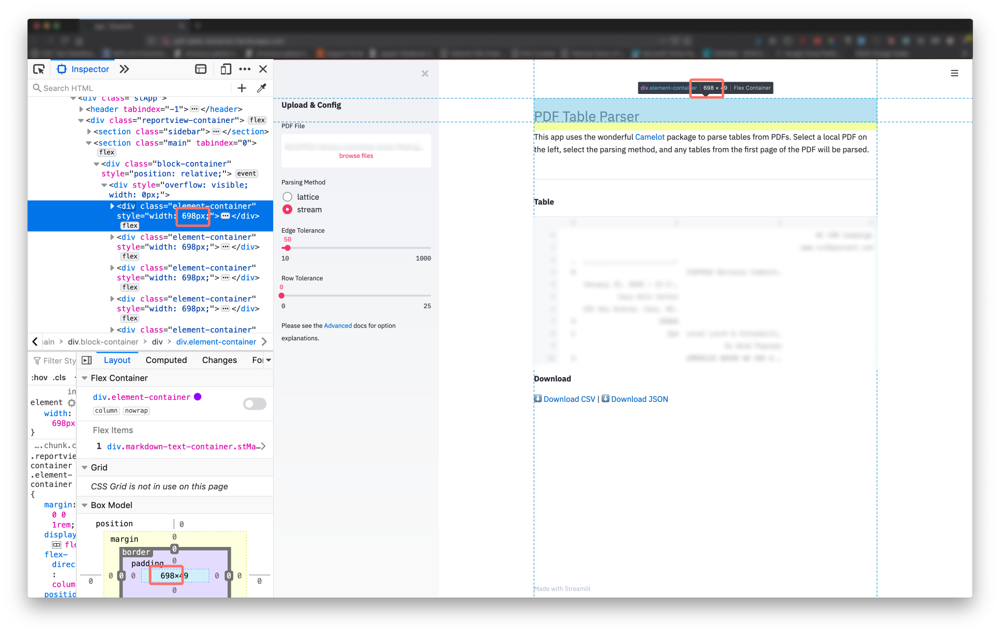
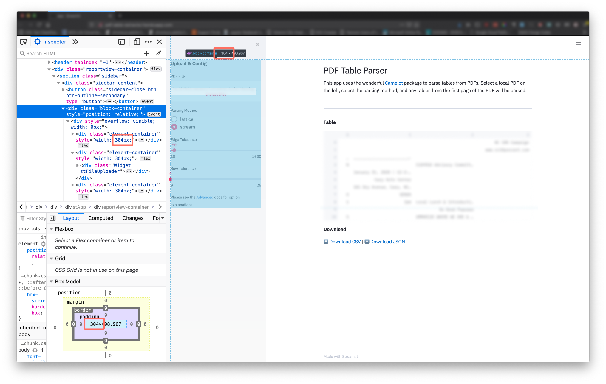
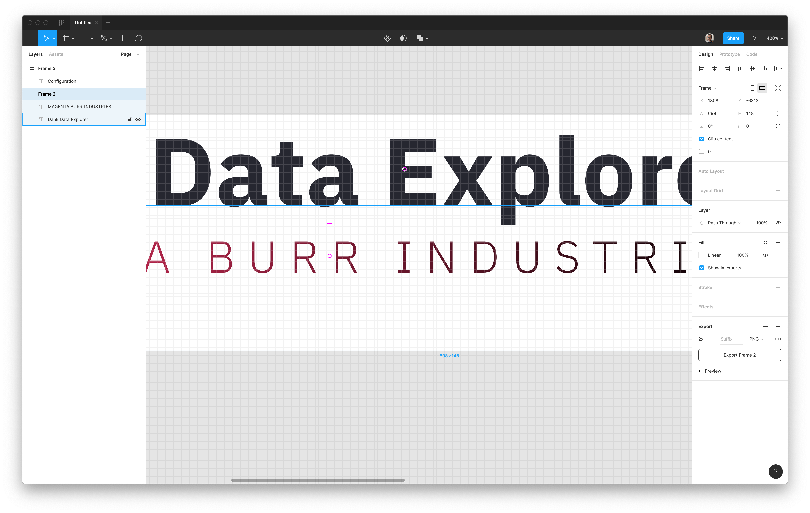

# Images

- [Images](#images)
  - [Summary](#summary)
  - [Container Sizes](#container-sizes)
    - [Details](#details)
  - [Creating Header Images](#creating-header-images)
    - [Using Figma](#using-figma)
  - [Displaying Your Image in App](#displaying-your-image-in-app)

## Summary
Images can be used to flexibly add header content, additional instructions, brand logos, or other information about your app. I've found it easiest to design images for the default width of the main container and sidebar for an app viewed on desktop. Since I don't need to view these images fullscreen or use the in an interactive way throughout the app, I use a helper function to convert images to bytes and display them as HTML through a `st.markdown`, rather than using `st.image`. I'll cover all these steps below.

## Container Sizes
`As of Feb 2, 2020.`

The main container content is `698px` wide. The sidebar content is `304px` wide.

### Details

Images detailing how these numbers were determined are expandable below.

<br>

<details>

<summary>View Main Content Width Determination</summary>

[](./images/main-width.png)

</details>

<br>

<details>

<summary>View Sidebar Width Determination</summary>

[](./images/sidebar-width.png)

</details>

## Creating Header Images

One simple use case for images is rich header images for your applications. An image allows you to display rich information about your brand. 

If you want to match the other content in your application, use the information from the [Theme Essentials](./essentials.md). You can download [`IBM Plex Sans`](https://fonts.google.com/specimen/IBM+Plex+Sans) and [`IBM Plex Mono`](https://fonts.google.com/specimen/IBM+Plex+Mono) from Google Fonts for local use.

The most staightforward way I've found to create header images, especially if they're mostly text, is to use [Figma](https://www.figma.com/). Figma is a tool typically used for designing interfaces, but I typically use it for more lightweight design tasks like creating simple image assets. As a plus, Figma is really easy to learn and has a relatively simple interface.

### Using Figma

[](./images/figma-example.png)

1. First, use the Frame tool to create a frame. This is a container for your image. Create the frame so it has a width of the streamlit container where it will be placed. You can adjust the height so it makes sense for your content.
2. Design to your heart's content. Start simple by using IBM Plex Sans as your font and the standard streamlit colors. Some simple elements to play around with are character spacing, all caps, and gradient scaling your text.
3. Once you're finished, select your Frame then use the Export menu in the lower right to export your image to your streamlit app directory.


## Displaying Your Image in App

Since I don't need any interaction with the image, I display the HTML through `st.markdown` rather than `st.image`. 

We'll convert the image to bytes so that it can be displayed using an `` HTML element. The helper function below takes the path to the image (from your `app.py`) and converts it to bytes.

```python
def img_to_bytes(img_path):
    img_bytes = Path(img_path).read_bytes()
    encoded = base64.b64encode(img_bytes).decode()
    return encoded
```

From there, you can use the image in your app as follows:

```python
header_html = "".format(
    img_to_bytes("header.png")
)
st.markdown(
    header_html, unsafe_allow_html=True,
)
```

Streamlit uses bootstrap, so we can take advantage of the `img-fluid` class to make sure that the image is responsive as the app is resized. 
